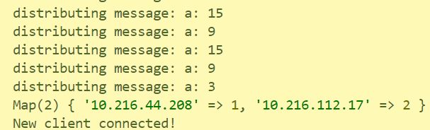
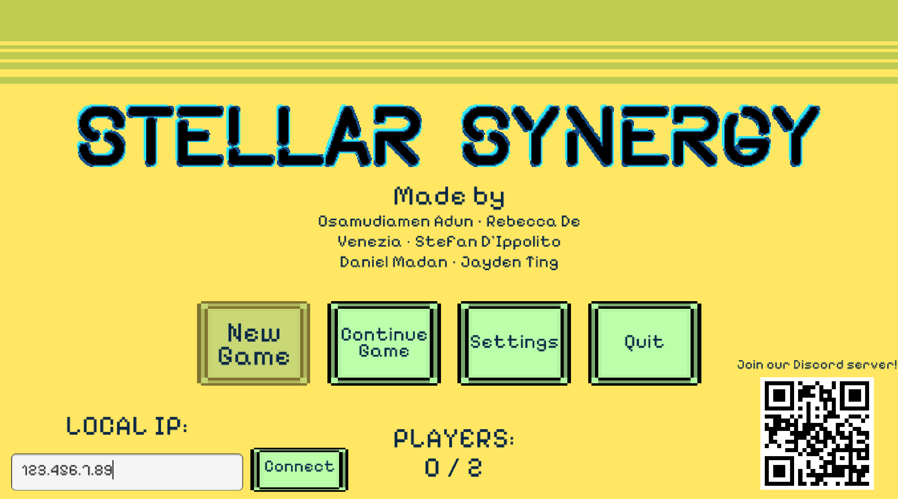

# How to run the server

## Please note that I only had access to Windows machines. While this should all work on Mac in theory, instructions may vary.

1. Install Node JS (and npm along with it) on your machine.
2. Using npm, install:
    * https
    * fs
    * path
    * express-ip
    * express
    * ws
    These can all be installed by running "npm install [name of package]" in the terminal.
3. Clone this project and navigate to the "Mobile Controls Web App" folder, then to the "public" subfolder. Open "ip.txt" in any text editor.
4. Now, you will need your local IP address in order to run the server. On Windows, you can easily access this by running "ipconfig" and copying the address next to IPv4. Still in the "Mobile Controls Web App" folder, replace the contents of "ip.txt" with your local IP address and save the file.
5. Use Node to run "server.js". You can do this with "node server.js" or by using VSCode and executing the file.
6. On any device connected to the same network (e.g. the machine running the server), navigate to `https://[your local IP address]:8443`. You should see a blue button that says "START." Note that you will have to click through a security warning because the site uses a self-signed certificate. In the terminal where Node JS executes, you should see your IP address mapped to the player number (player 1 or player 2) along with "New client connected!":

 

7. Now, try connecting with two mobile devices. Accept when the web app asks permission to use orientation data. Devices are assigned to player 1 and 2 in order of joining. If player one is connected correctly, you should be able to see a stream of numbers output like this (these represent the angles being output for the gun):

Note that the rotation angles are based off the "pitch":

If you have two players connected and can see that stream of numbers, you're good to go!

8. Now run the game. On the main menu, you will see a text box at the bottom where you must input your local IP address again. Hit connect, so that Unity can connect to the WebSocket server:

The number of players connected will match the number of connected IPs on the server.

9. Lock the orientation of the mobile devices, so the pages don't "flip" during gameplay.

**Note that the game only allows a maximum of two players for security reasons. Any additional devices that try to join will be served a 404 page.**

## Troubleshooting
* When loading the site, ensure you have the correct port number and that `https://` is part of the URL.
* If using Queen's wifi, don't use eduroam (I think there are additional firewalls). The game was tested on Queen'sU-Secure (unsure about other wifi networks). It should also work on your network at home.
* Ensure you have a strong wifi connection and that you can load pages other than the controls site.
* Make sure the devices are all connected to the same network.
* As a first line of defense, disconnect and reconnect both players. The best way to disconnect/reconnect is to close the tab and open it again, from the initial page with the "start" button (e.g. not the "/play" page with the actual controls) as sometimes the permissions need to be re-accepted.
* Sometimes, the browser needs to be quit and open again on the mobile devices to register the change in orientation data permissions. You should see the stream of numbers output after a refresh of the device registered to player 1.
* In the event of player disconnects, the page(s) will need to be refreshed to update the player controls, e.g. if player 1 disconnects, player 2 should refresh their page so that they will be assigned player 1 controls. In rare cases, if the pages aren't updated with the correct controls after one or multiple disconnects/refreshes, disconnect both players and rejoin in the desired order or restart the server and reconnect both players. Ideally, this should all be handled automatically; I'm currently working on it :)
* Don't have cellular data enabled on the mobile devices, this seems to interfere with the fact that the mobile devices must be connected to the same network.
* If you have any antiviruses enabled, disable them.
* Ensure the device being used as player 1 supports orientation data. If it doesn't, you will get an alert saying "DeviceMotionEvent not defined."
* Try restarting the server.

## If all else fails

Email 18rldv@queensu.ca. I respond fast :D

The keyboard controls are also listed here:

* Aim: mouse
* Shoot: E
* Move: L/R arrow keys, or W/D
* Kick: T
* Punch: Q
* Jump: C and V 
* Pause: Esc (on both keyboard and mobile controls)